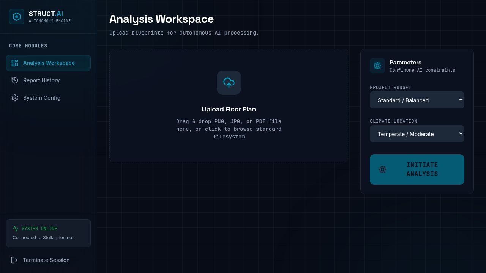
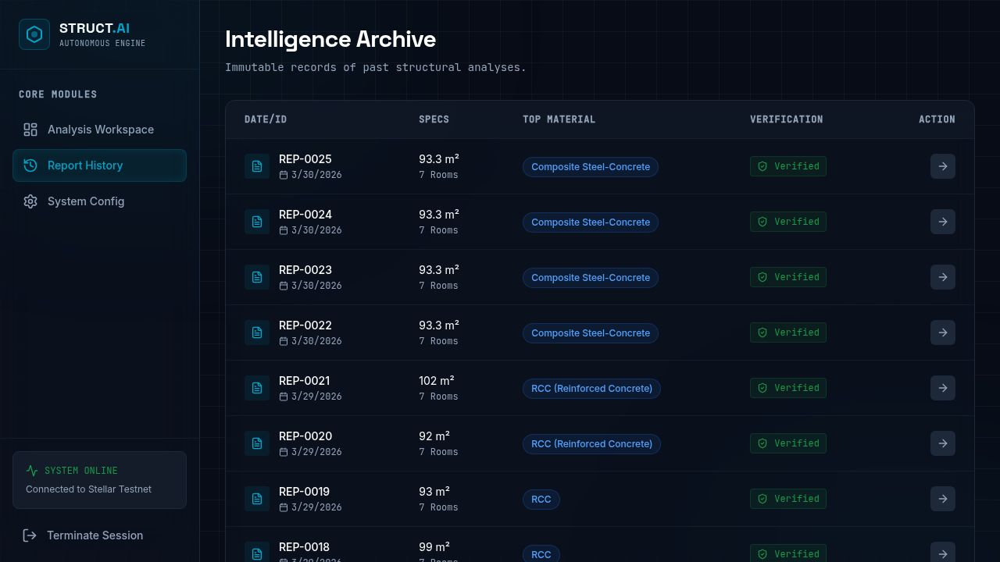

# hack-a-struct

Upload a 2D floor plan image. Get back a structural analysis, interactive 3D model, ranked material recommendations, and a blockchain-verified audit report — in under 5 seconds. No LLM API calls. Everything is deterministic.

---

## Project Description

hack-a-struct is a full-stack structural intelligence tool built for the AI/ML track of the hackathon. It takes a clean digital floor plan (PNG/JPG) and runs it through a 5-stage pipeline:

1. **Parse** — OpenCV detects walls, measures room polygons, and calibrates pixels to real-world metres
2. **Reconstruct** — wall segments are classified as load-bearing or partition; spans are computed
3. **Visualise** — Three.js renders an interactive 3D model in the browser (orbit, zoom, inspect walls)
4. **Score** — 37 construction materials are ranked per structural element using a weighted formula (strength 35%, cost 30%, durability 20%, climate fit 15%), penalised for unsafe spans
5. **Anchor** — a SHA-256 hash of every report is submitted to the Stellar blockchain as a real, verifiable transaction

Every report is permanent and auditable. No mock data. No AI API calls. All logic runs locally.

---

## Project Vision

Construction material decisions in small and mid-scale projects often happen without formal analysis — the engineer picks what they know, or what's cheapest on that week's market. Mistakes are costly and sometimes dangerous. hack-a-struct exists to give any engineer or architect fast, reproducible structural intelligence: upload a floor plan, get evidence-backed material rankings, and walk away with a blockchain receipt proving the analysis was done and exactly what it said. Eventually this could feed into permit approval workflows, insurance assessments, or multi-site comparison dashboards.

---

## Key Features

- **OpenCV floor plan parser** — detects walls via probabilistic Hough transform, extracts room polygons with contour analysis, computes real-world m² from pixel density calibration
- **37-material scoring engine** — covers Masonry, Concrete, Steel, Timber, Earth, and Composite categories; formula is tunable by budget and climate zone
- **Three.js 3D viewer** — walls extruded to 3 m, colour-coded by structural type (load-bearing = cyan, partition = steel blue), orbit controls and grid helpers
- **Stellar blockchain anchoring** — SHA-256 hash submitted as a real Stellar testnet TX from a pre-funded account; TX is live and queryable on Stellar Expert
- **Deployed Soroban contract** — `hash-anchor` contract stores hashes on-chain with `store_hash`, `get_hash`, and `get_count` functions
- **Frontend Stellar SDK integration** — React app calls the Soroban contract via `@stellar/stellar-sdk` to read live contract state (record count, hash lookup) directly from the browser
- **SQLite report history** — every analysis stored locally; browsable in the Reports page

---

## Deployed Smart Contract Details

**Contract ID:**
```
CC4S4DUCM7FRWU2OZZA7F76JBXDWRFQLXFXNTON6XSC6DXH567B3WDOZ
```

**Network:** Stellar Testnet

**Block Explorer:**
[View on Stellar Expert →](https://stellar.expert/explorer/testnet/contract/CC4S4DUCM7FRWU2OZZA7F76JBXDWRFQLXFXNTON6XSC6DXH567B3WDOZ)

| Field | Value |
|---|---|
| Contract ID | `CC4S4DUCM7FRWU2OZZA7F76JBXDWRFQLXFXNTON6XSC6DXH567B3WDOZ` |
| WASM Hash | `4e72496da69557b5d302274aa7103f8df2452df8668dec5362925716be289023` |
| Deploy TX | [`a94a3e78...`](https://stellar.expert/explorer/testnet/tx/a94a3e78b30ff91afb469029e3dd59949efd87d6a10898c7c04e362cd830b271) |
| Anchor Account | [`GABJGR3I...`](https://stellar.expert/explorer/testnet/account/GABJGR3IP74R7A5J2HJTM5QVJUWXZHQ6FHBEH5JCDP3ZXVDMTQYZNCOV) |
| Sample TX | [`919a3619...`](https://stellar.expert/explorer/testnet/tx/919a3619dc2565bfca357d7bddee28156a8f9cf967c6cd320b1e29e430d4aa18) |

**Contract functions:**
- `store_hash(report_hash: String) → u64` — stores a SHA-256 digest, returns record ID
- `get_hash(id: u64) → Option<String>` — retrieves hash by record ID
- `get_count() → u64` — total records stored on-chain

The `BlockchainBadge` component in the frontend calls `contractGetCount()` and `contractGetHash()` via the Stellar JS SDK — these hit the deployed contract directly, no backend required.

> **Screenshot of deployed contract on Stellar Expert:**
> Open [this link](https://stellar.expert/explorer/testnet/contract/CC4S4DUCM7FRWU2OZZA7F76JBXDWRFQLXFXNTON6XSC6DXH567B3WDOZ) to see the live contract on-chain.

---

## UI Screenshots

**Analysis Workspace — upload a floor plan and configure parameters:**



**Report History — all past analyses with blockchain verification status:**



---

## Project Setup

**Requirements:** Python 3.11+, Node.js 18+, pnpm 8+

**1. Python backend**
```bash
cd artifacts/structural-ai-backend
pip install -r requirements.txt
python main.py
# Runs on port 8000
```

**2. Frontend + API server**
```bash
pnpm install
pnpm --filter @workspace/api-server run dev      # Express proxy on port 8080
pnpm --filter @workspace/structural-ai run dev   # React + Vite on port 5173
```

No API keys or environment variables needed. The Stellar account is pre-funded on testnet.

**3. Smart contract (already deployed — only needed for local re-deploy)**
```bash
rustup target add wasm32-unknown-unknown
cd contracts
cargo build --release --target wasm32-unknown-unknown
stellar contract deploy \
  --wasm hash-anchor/target/wasm32-unknown-unknown/release/hash_anchor.wasm \
  --source <your-secret-key> \
  --network testnet
```

---

## Repo Structure

```
hack-a-struct/
├── contracts/
│   ├── Cargo.toml          ← Rust workspace config
│   ├── Cargo.lock
│   └── hash-anchor/
│       ├── Cargo.toml
│       ├── README.md
│       └── src/lib.rs      ← Soroban contract (store_hash, get_hash, get_count)
│
├── artifacts/
│   ├── structural-ai/             ← React + Vite frontend (TypeScript + Tailwind)
│   │   └── src/
│   │       ├── lib/stellar-integration.ts   ← Stellar JS SDK integration
│   │       ├── components/ui/BlockchainBadge.tsx
│   │       ├── components/3d/FloorPlanModel.tsx
│   │       └── pages/Dashboard.tsx
│   │
│   ├── structural-ai-backend/     ← Python FastAPI backend
│   │   └── app/services/
│   │       ├── floor_plan_analyzer.py    ← OpenCV pipeline
│   │       ├── material_recommender.py   ← scoring engine (37 materials)
│   │       └── stellar_blockchain.py     ← Python Stellar SDK (TX submission)
│   │
│   └── api-server/                ← Node.js Express proxy
│
└── README.md
```

**Frontend lives in** `artifacts/structural-ai/src/`
**Smart contract lives in** `contracts/hash-anchor/`
**Stellar SDK integration lives in** `artifacts/structural-ai/src/lib/stellar-integration.ts`

---

## Scoring Formula

```
Score = 0.35 × Strength
      + 0.30 × (1 − NormCost) × BudgetMultiplier
      + 0.20 × Durability
      + 0.15 × ClimateFit
      − SpanPenalty
```

`BudgetMultiplier`: low budget = 1.5× (cost matters more), premium = 0.6×
`SpanPenalty`: if detected span exceeds material's safe limit, subtract up to 40 pts proportionally
`Durability`: normalised service life over 150 years

Materials are ranked per element type — a load-bearing wall gets different top picks than a partition wall.

---

## Future Scope

- Call `store_hash` on the Soroban contract directly from the frontend, bypassing the Python backend entirely for the blockchain step — the contract is already deployed and the JS SDK integration is in place
- Hash the uploaded floor plan image (not just the analysis output) to create full chain-of-custody from raw input to final report
- Deploy to Stellar mainnet for production use in real permit workflows
- Generate a signed PDF report with the TX ID as an embedded QR code — useful for building authority submissions
- Extend the material scoring to include IS:1893 seismic and IS:875 wind load factors
- Multi-storey support: detect staircases and inter-floor structural dependencies
- Live construction material pricing via market APIs instead of the static database
